## 火狐浏览器使用方法

**注意：** 本服务使用范围仅限于技术学习。

1. 点击火狐浏览器右上角**按钮**，并点击**扩展和主题**。

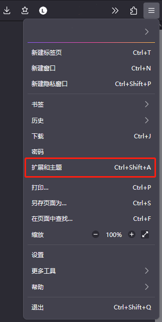

2. 在弹出页面中，搜索**foxyproxy**。

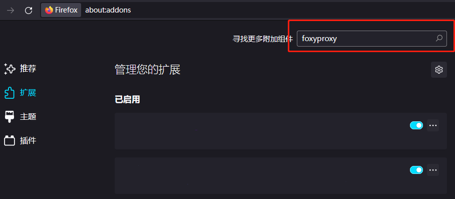

3. 点击第一个搜索结果。

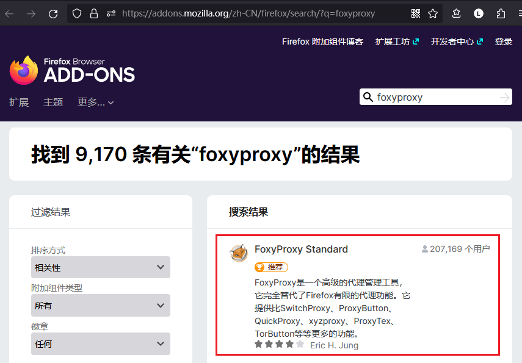

4. 点击**添加到Firefox**
 
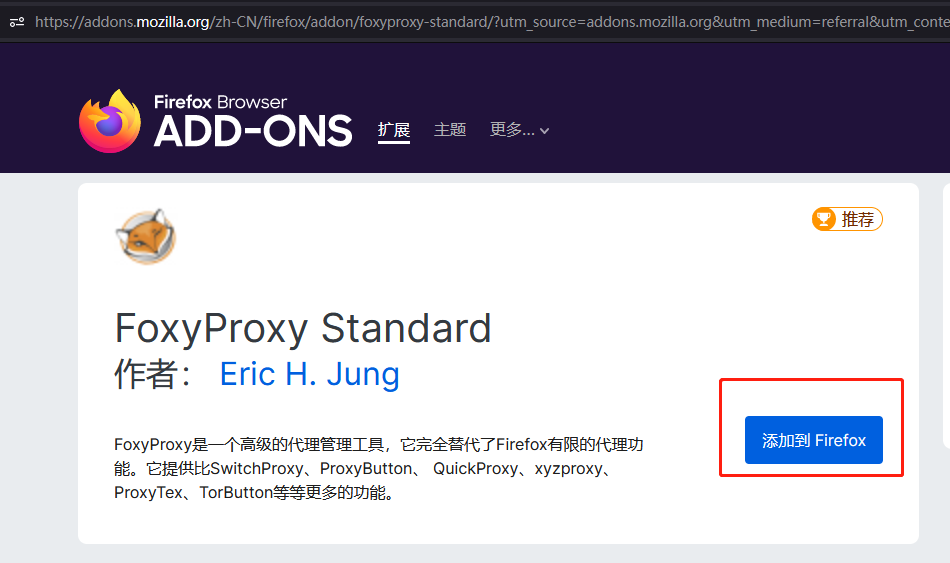

5. 在右上角弹窗中，点击**添加**按钮。
 
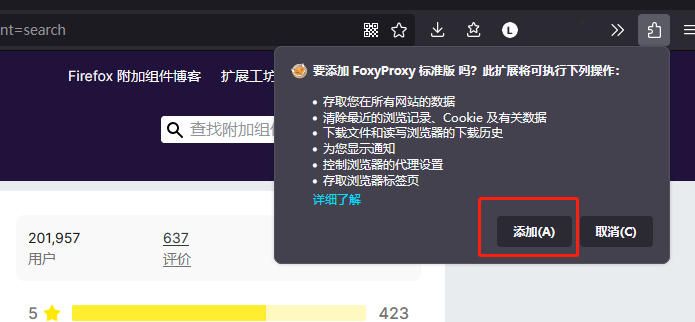

6. 点击右上角**扩展**按钮，然后在弹窗中找到 **FoxyProxy**，并点击它。
 
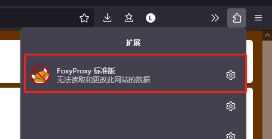

7. 在 **FoxyProxy** 弹窗中，点击 **选型** 按钮。
 
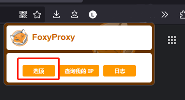

8. 在 **Foxyproxy** 设置页面，点击 **添加** 按钮，添加一个代理。

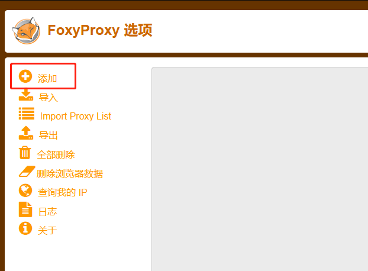

9. 按图填写配置并保存。

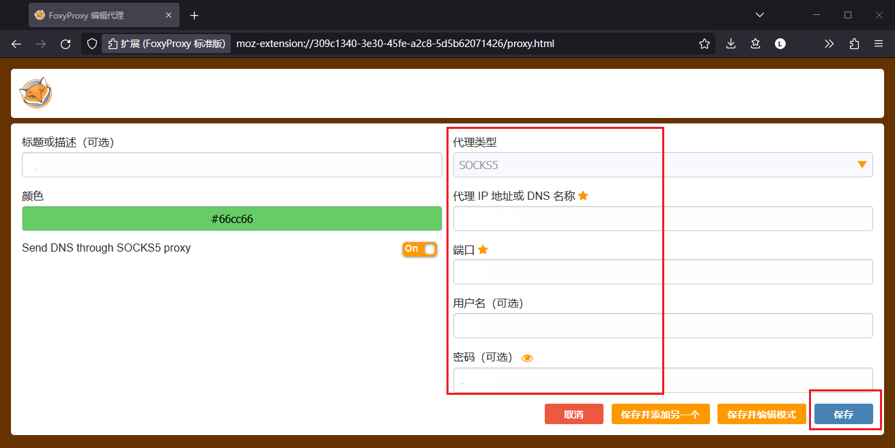

10. 在右上脚 **扩展按钮** 下，找到 FoxyProxy，并选中刚添加的代理，开始使用代理。

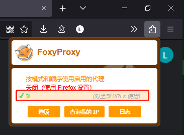

11. 对于国内网站，选中**关闭**，停用代理，以更快的访问网站。

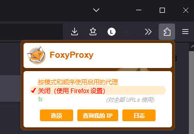

12. 为了方便切换代理（可选），可将 **FoxyProxy** 固定到工具栏。即在右上脚 **扩展按钮** 下，找到 FoxyProxy，点击右侧的**设置**图标，然后点击固定到工具栏。

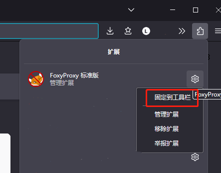
